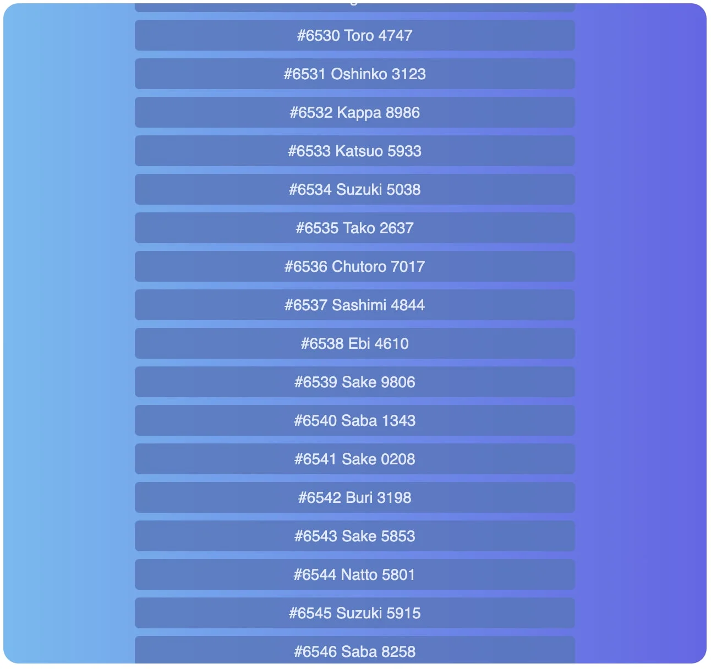

<p align="center"></p>
<h2 align="center">svelte-virtuallists</h2>
<p align="center">Keep your page efficient and fast: only shows the visible items!</p>

<p align="center">
  <a href="https://badgen.net/npm/v/svelte-virtuallists"></a>
  <a href="https://badgen.net/packagephobia/publish/svelte-virtuallists"></a>
  <a href="https://badgen.net/packagephobia/publish/svelte-virtuallists"></a>
    <a href="https://orefalo.github.io/svelte-virtuallists/minified-size-badge.svg"></a>
      <a href="https://badgen.net/github/contributors/orefalo/svelte-virtuallists"></a>
</p>
<p align="center">
  <a href="#about">About</a> •
  <a href="#features">Features</a> •
  <a href="#usage">Usage</a> •
  <a href="#examples">Demos</a> •
  <a href="#samples">Samples</a>
</p>



## About

Keep your tables and lists efficient and fast: only render the visible items, instead of displaying all your data in large lists.

This package is a merge of [svelte-tiny-virtual-list](https://github.com/jonasgeiler/svelte-tiny-virtual-list) and [he-virtual-list](https://github.com/phphe/virtual-list), ported to Svelte 5. I spend many many hours to learn and build an improved version. Many thanks to the original authors.

## Features

- ❺❺➎⓹⓹ **Svelte 5+ only**
  Build for Svelte 5+ in Typescript.

- 🚀 **Performant**
  Render millions of items, without breaking a sweat.

- 🛠 **Configurable**
  Customize width, heigh, position, style, content.
  
- 💠 **Layout Control**
  Headless, support fixed and variables sizing, along with vertical and horizontal lists and tables.

- 🧩 **Programming Interface**
  Set positions and properties, raises events on state mutation.

- 💼 **Small**
  Compact and dependency free – Only ~5kb when compressed.

## Installation
`npm i svelte-virtuallists`

## Usage

This component can be used two different ways:

- 🤖 As a scrollable listover a large number of items, optionally read incrementally.

- 🧠 As a fondation for more complex components - TreeViews and DataGrids.

## Browser Support

|  |  |  |  |  |  |
| ---------------------------------------------------------------------------------------- | ------------------------------------------------------------------------------------------- | ---------------------------------------------------------------------------------------- | ------------------------------------------------------------------------------------- | ---------------------------------------------------------------------------------- | ---------------------------------------------------------------------------------------------------------------------------- |
| Latest ✔                                                                                | Latest ✔                                                                                   | Latest ✔                                                                                | Latest ✔                                                                             | Latest ✔                                                                          | 11 ✔                                                                                                                        |

## Star History

[](https://star-history.com/#orefalo/svelte-virtuallists&Date)

## Examples

- [Demos](https://orefalo.github.io/svelte-virtuallists/)

## Samples

```svelte
<script>
	import { VirtualList } from 'svelte-virtuallists';

	const data = ['A', 'B', 'C', 'D', 'E', 'F' /* ... */];
</script>

<VirtualList class='mystyle' style='width:100%;height:600px;' items={data}>
	{#snippet vl_slot({ index, item })}
		<div>
			Row: #{index} Item: {item}
		</div>
	{/snippet}
</VirtualList>
```

### Props

The component accepts the following properties

| Property          | Type        | Required? | Description  |
| ----------------- | ----------- | :-------: | ------------ |
| items | `any[]` | ✓ | the model, the data for the items to display in the list. |
| isHorizontal | `boolean (false)` |  | Whether the list should scroll vertically or horizontally. One of `'vertical'` (default) or `'horizontal'`. |
| isDisabled | `boolean (false)` | | When the component is disabled it renders as a regular list |
| isTable | `boolean (false)` |  | Whether the rendering should be a table layout |
| sizeCalculator    | `(index: number, item:any) => number   alias   SizingCalculatorFn`                                                                                                                                                                                      |    | Not recommended, as the component will adjust to the css rendering. If you need to control the sizing programmatically, use a function that returns the size (height or width) of the rendered row or column. This function's output is used for scrollbar positioning and is passed to the vl_slot. |
| scrollToOffset      | `number`(in pixels)               |           | Can be used to control the scrollbar offset in pixel. **scrollToIndex** and **scrollToOffset** MUST not be used together. |
| scrollToIndex     | `number`(item index)               |           | Moves the scrollbar to display the given item (at index). Follows scroll behavior and alignment policies. **scrollToIndex** and **scrollToOffset** MUST not be used together. |
| scrollToAlignment | `string (AUTO)`                     |           | Used in combination with **scrollToIndex** and **scrollToOffset**.  Use `'start'` to always align items to the top of the container and `'end'` to align them bottom. Use `'center`' to align them in the middle of the container. `'auto'` scrolls the least amount possible to ensure that the specified `scrollToIndex` item is fully visible. |
| scrollToBehaviour | `string (AUTO)`               |           | Used in combination with **scrollToIndex** and **scrollToOffset**,  controls the scrolling behaviour movement. One of: `'auto'`, `'smooth'` or `'instant'` (default).                                                                                                                                                                                                                          |

### Snippets

| Property | Type                                                      | Required? | Description                                                  |
| -------- | --------------------------------------------------------- | :-------: | ------------------------------------------------------------ |
| vl_slot  | `(index:number, item:any, size?:number) => SnippetResult` |     ✓     | Snippet called to render every item, see description below. Typescript signature **VLSlotSignature** |
| header   | `() => SnippetResult`                                     |           | Useful in table mode to render the table header columns.     |
| footer   | `() => SnippetResult`                                     |           | Useful in table mode to render any table footer.             |

For instance,

```svelte
<VirtualList items={myModel} style="height:600px">
  {#snippet vl_slot({ index, item }: VLSlotSignature)}
    <div style="border: 1px solid rgb(204, 204, 204);">
      Index:{index} Content:{item.text}
    </div>
  {/snippet}
</VirtualList>
```

### Events

| Property             | Type              | Required? | Description                                                  |
| -------------------- | ----------------- | :-------: | ------------------------------------------------------------ |
| onAfterScroll        | `{offset, event}` |           | Fired when the scrollbar changes position.                   |
| onVisibleRangeUpdate | `{start, end}`    |           | Fired when the visible window is sliding to display new items |


- `onAfterScroll` 

Accepts a function with the following signature `(event):VLScrollEvent => void`

```typescript
export interface VLScrollEvent {
  // either the value of `wrapper.scrollTop` or `wrapper.scrollLeft`
  offset: number | string;
  // the original event
  event: Event;
}
```

- `onVisibleRangeUpdate` 

Accepts a function with the following signature `(range):VLRangeEvent => void`

```typescript
export interface VLRangeEvent {
  // index of the first visible item
  start: number;
  // index of the last visible item
  end: number;
}
```

## Contributing

Please read [CODE OF CONDUCT](CODE_OF_CONDUCT.md) and the [CONTRIBUTION](CONTRIBUTING.md) guide for more details.
